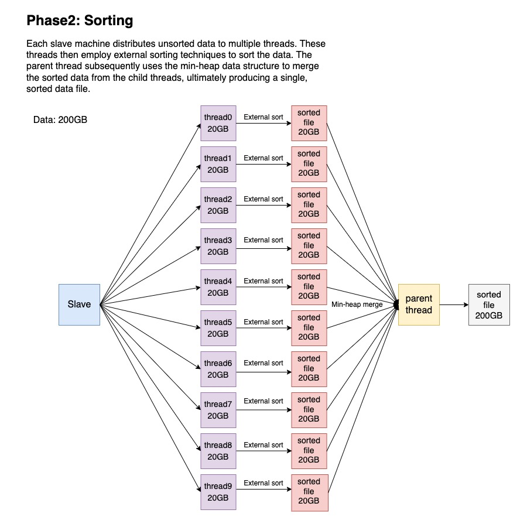
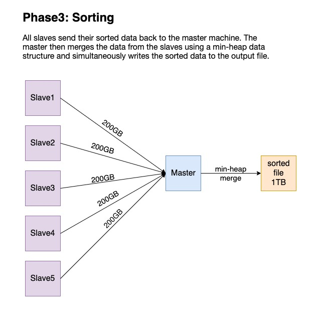

# Distributed Sorting

This is a project for the course Operating Systems at the University of Wisconsin-Madison.
This project try to sort a large file (1T) using multiple machines.

## Usage

Generate 1 TB testing file. One record is 100 byte and the number for parameter -a is the number of records.

```shell
./gensort-1.5/gensort -a 10000000000  ./input
```

Compile and Run external_sort
```shell
make && ./external_sort ./input ./output
```

Compile and Run master
-p: port number for socket listening
-n: the number of slaves
-i: input file(unsorted data file)
-o: output file for sorted data
```shell
make && ./main -m master -p 12345 -n 3 -i ./input -o ./output
```

Compile and Run slave
-s: master's ip address
-p: master's socket listening port
```shell
make && ./main -m slave -s 10.182.0.5 -p 12345
```

Check if the output is correct
```shell
./gensort-1.5/valsort ./output
```

## Algorithm

### Phase 1: Splitting

### Phase 2: Sorting

### Phase 3: Merging

## Result
1 Master(16 vCPU, 64GB memory)  
0 Slave  
Sorting size 100MB at a time
| Size | Single thread | Multi-thread | 
| ------------- | ------------- | ------------- |
| 1 GB  | 44.47 s | 12.165 s |
| 10 GB | 366.02 s  | 147.780 s |
| 20 GB | 959.96 s  | 338.229 s |
| 100 GB | 4150.04 s  | 2788.717 s |
| 1 TB | 50095.23 s  | 23957.181 s |
  
1 Master(16 vCPU, 64GB memory)  
0 Slave  
Sorting size 1000MB at a time
| Size | Single thread | Multi-thread | 
| ------------- | ------------- | ------------- |
| 1 GB  | 24.91 s | 28.208 s |
| 10 GB | 416.90 s  | 155.401s |
| 20 GB | 812.23 s | 333.496 s |
| 100 GB | 3940.85 s  | 2262.587 s |
| 1 TB | 39888.66 s  | 23702.246 s |
  
1 Master(2 vCPU, 4 GB memory)  
3 Slaves(10 vCPU, 40 GB memory)  
Sorting size 100MB at a time  
Master sends file to slaves network speed: 17.79MiB/s  
Master receives sorted files from slaves network speed: 4.64MiB/s
| Size | Multi-thread | 
| ------------- | ------------- | 
| 1 GB  | 198.68 s | 
| 10 GB | 2940.81 s  | 
| 20 GB | 5899.88 s | 
| 100 GB | 29478.32 s | 
| 500 GB | 156017.32s | 
  
1 Master(2 vCPU, 4 GB memory)  
5 Slaves(16 vCPU, 24 GB memory)  
Sorting size 100MB at a time  
Master sends file to slaves network speed: 17.79MiB/s  
Master receives sorted files from slaves network speed: 4.64MiB/s
| Size | Multi-thread | 
| ------------- | ------------- | 
| 1 GB  | 198.88 s | 
| 10 GB | 2462.84 s  | 
| 20 GB | 5178.82 s | 
| 100 GB | 26646.28 s | 
  
It is evident that when comparing multi-node sorting to single node sorting, network bandwidth serves as the limiting factor, resulting in faster sorting times for single node sorting. Given equal network bandwidth conditions, sorting on 6 nodes is observed to be quicker than sorting on 4 nodes. Thus, it is speculated that with an improvement in network speed and an increase in the number of nodes, the possibility of a shorter sorting time compared to single node sorting exists.
