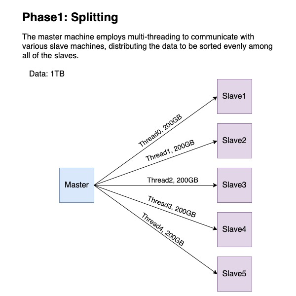

# Distributed Sorting

This is a project for the course Operating Systems at the University of Wisconsin-Madison.
This project try to sort a large file (1T) using multiple machines.

## Usage

Generate testing file.

```shell
./gensort-1.5/gensort -a 100000 ./input
```

Compile and Run external_sort
```shell
make && ./external_sort ./input ./output
```

Check if the output is correct
```shell
./gensort-1.5/valsort ./output
```

test

## Algorithm

### Phase 1: Splitting

### Phase 2: Sorting

### Phase 3: Merging

## Result
| Size | Single thread | Multi-thread | 
| ------------- | ------------- | ------------- |
| 1 GB  | 44.47 s | 12.165 s |
| 10 GB | 366.02 s  | 147.780 s |